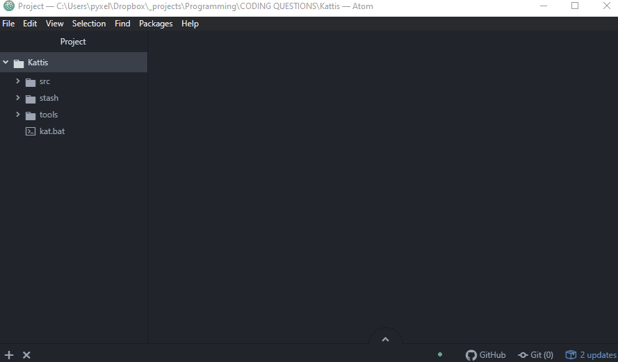

# Kat

A couple of Python scripts to make life easy when practicing on Kattis.  
Written for Windows and for C++ language (`g++` compiler must already be available).

See the [Workflows](#workflows) section for usage.



## Installation

Note that for non-Windows platforms, the Python interpreter is specified as
`python3` instead of `python`. These are Windows instructions. For Mac/Linux,
you can quickly look up the correct syntax for the following steps.

1. Ensure [Python >= 3.6](https://www.python.org/downloads/) exists and
   interpreter added to path, i.e. make sure the following runs:

```
python --version
```

2. Clone this repository, or download and extract .zip of the repo:

```
git clone https://github.com/pyuxiang/Kattis-Helper.git
```

3. (Optional) Setup your virtual environment in the repository folder, and
   activate the environment:

```
python -m venv .venv
.venv\Scripts\activate
```

3. Install required Python libraries (`--user` is fine too):

```
pip install -r requirements.txt
```

4. Add Kattis credentials:  
   - Replace `tools/.kattisrc` with your own account's config file, from [here](https://open.kattis.com/download/kattisrc)
   - Modify `tools/pwd.json` to include your login credentials (email + password)

5. (Recommended) Install the additional dependencies:
   - (Non-Windows) Add `wkhtmltopdf` binaries to `./tools` (Windows binary already supplied), allows printing of `.pdf` of the problem.
   - (Non-Windows) Download Chrome and modify `FILE_CHROME` in `kat.py` to point to the correct directory containing `chrome.exe` (currently Windows default directory), allows direct opening of submission history after submitting.
   - Modify `tools/template.cpp` to your liking (but keep `[[INPUT LINE]]` there).

You're done setting up! For Windows users, a batch file `kat.bat` is provided for
quick access to the scripts. Mac and Linux users, you gotta add your own `.sh`
script extensions to replicate the same functionality.


## Workflows

Note that the `kat` is a batch file (i.e. for Windows command prompt).
If using Powershell, use `.\kat`. If on Mac/Linux, write your own bash script ya.

- Download specific problems: `kat get shortestpath4 forestfruits`
- Download random problem of specified difficulty: `kat get _medium`
- Submit problem: `kat submit shortestpath4`
- Get submission AC record: `kat record`
- Shelve incomplete work for later: `kat stash` (similar to `git stash push`)
- Retrieve previously shelved work: `kat unstash` (similar to `git stash pull`)
- Archive all solutions into `/src` and delete temp files: `kat pack`

You can alternatively manually call the Python script using:

```
tools\kat.py -h
```

## Repository overview

Free for all to use without liability, under MIT license.
Feel free to delete `LICENSE` and `README.md` for your own deployment (already included in `kat.py`).

- `tools/.kattisrc` is the Kattis configuration file (ought to use this exclusively for
  login, etc., but I'm lazy)
- `tools/.submit` is Kattis submission script with some personal touches listed on top
- `tools/demo.gif` shows the demo on this page :)
- `tools/kat.py` is the main script for everything
- `tools/pwd.json` should store your Kattis account info in (dangerous) plaintext :O
- `tools/template.cpp` provides the starting template
- `tools/wkhtmltopdf.exe` is the Windows binary of `wkhtmltopdf` under LGPLv3 license,
  can be downloaded [here](https://wkhtmltopdf.org/)
- `stash/` contains all your shelved work after calling `kat stash`
- `src/` contains all your archived work after calling `kat pack`
- `kat.bat` is the convenience script (for Windows cmd.exe)

## Caveats

Very very badly written code for personal use.  
Suggested improvements throw in `Issues` or something, I'm just lazy to refactor :)
